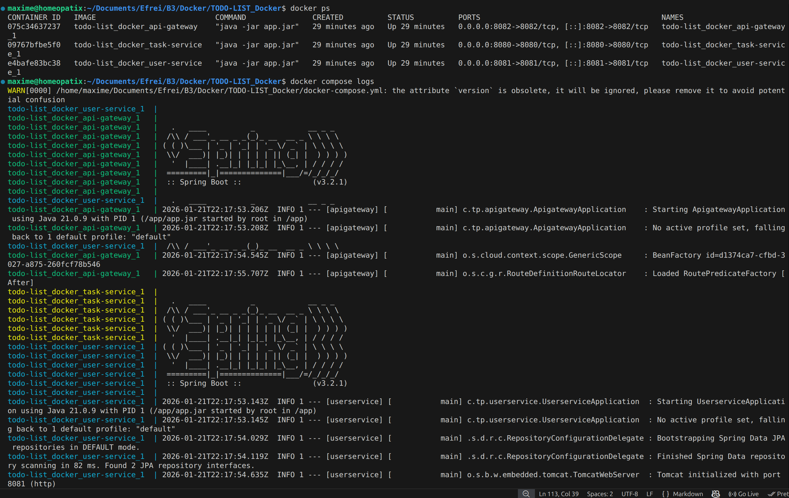
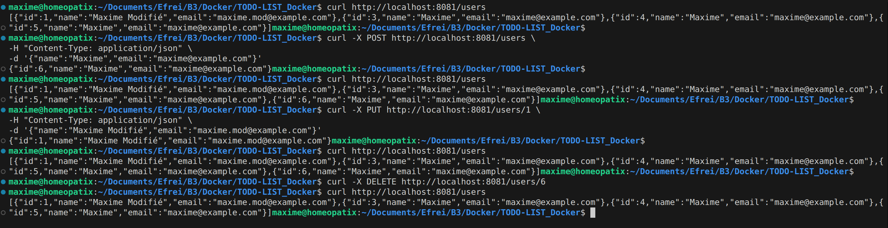
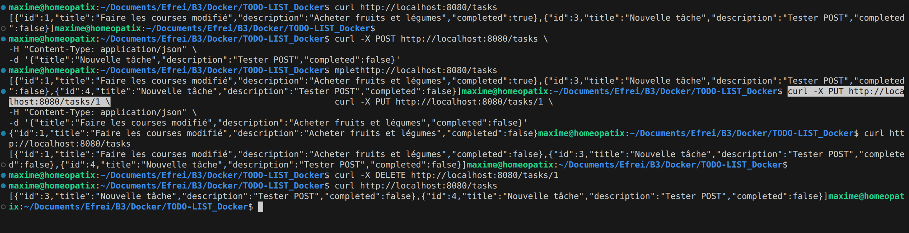
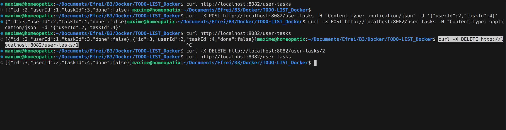

# To-Do List Microservices -- Docker & Kubernetes

## 1. Description du projet

Ce projet met en œuvre une architecture microservices pour la gestion d'une **To-Do List**, composée de :

* **UserService** : gestion des utilisateurs (CRUD)
* **TaskService** : gestion des tâches (CRUD)
* **APIGateway** : point d'entrée unique pour les utilisateurs et tâches, basé sur Spring Cloud Gateway

L'ensemble est conteneurisé avec **Docker** et peut être orchestré avec **Kubernetes**.

Architecture :

Client → API Gateway → UserService / TaskService

Pour vérifier la communication inter-services, la route **User-Tasks** permet d’associer un utilisateur à une tâche et de marquer une tâche comme faite.

---

## 2. Technologies utilisées

* Java 21
* Spring Boot 3.2.1
* Spring Data JPA
* Spring Cloud Gateway
* H2 Database
* Docker
* Docker Compose
* Kubernetes (optionnel)
* kubectl
* curl (pour tester les endpoints REST)

---

## 3. Répartition du travail

* **Maxime Desclaux** :

  * Mise en place du **TaskService** (CRUD des tâches)
  * Création et tests des endpoints `tasks`
  * Mise en place des commandes curl pour les tâches

* **Florine Saidi** :

  * Mise en place du **UserService** (CRUD des utilisateurs)
  * Création et tests des endpoints `users`
  * Mise en place des commandes curl pour les utilisateurs

* **Travail commun** :

  * API Gateway (routes `user-tasks`)
  * Communication entre services (User-Task)
  * Dockerisation et Docker Compose
  * Tests d’intégration via curl
  * Préparation des captures d’écran

---

## 4. Lancement avec Docker Compose

Se placer dans le dossier du projet contenant le `docker-compose.yml` :

```bash
docker compose build
docker compose up -d
```

Accès aux services via :

* UserService : [http://localhost:8081/users](http://localhost:8081/users)
* TaskService : [http://localhost:8080/tasks](http://localhost:8080/tasks)
* API Gateway (User-Tasks) : [http://localhost:8082/user-tasks](http://localhost:8082/user-tasks)

---

## 5. Tests fonctionnels via curl

### Gestion des utilisateurs (Florine)

```bash
curl http://localhost:8081/users
curl -X POST http://localhost:8081/users -H "Content-Type: application/json" -d '{"name":"Maxime","email":"maxime@example.com"}'
curl -X PUT http://localhost:8081/users/1 -H "Content-Type: application/json" -d '{"name":"Maxime Modifié","email":"maxime.mod@example.com"}'
curl -X DELETE http://localhost:8081/users/2
```

### Gestion des tâches (Maxime)

```bash
curl http://localhost:8080/tasks
curl -X POST http://localhost:8080/tasks -H "Content-Type: application/json" -d '{"title":"Nouvelle tâche","description":"Tester POST","completed":false}'
curl -X PUT http://localhost:8080/tasks/1 -H "Content-Type: application/json" -d '{"title":"Faire les courses modifié","description":"Acheter fruits et légumes","completed":true}'
curl -X DELETE http://localhost:8080/tasks/2
```

### Communication inter-services (Maxime & Florine)

```bash
curl http://localhost:8082/user-tasks
curl -X POST http://localhost:8082/user-tasks -H "Content-Type: application/json" -d '{"userId":1,"taskId":3}'
curl -X DELETE http://localhost:8082/user-tasks/1
```

---

## 6. Captures d’écran recommandées

* Docker Compose : `docker compose ps` et `docker compose logs`




* Commandes curl pour les créations, modifications et suppressions (users, tasks, user-tasks)










* Kubernetes (si déployé) :

  * `kubectl get pods`
  * `kubectl get services`
  * Test curl via NodePort exposé


---

## 7. Conclusion

Ce projet démontre la mise en œuvre complète :

* Architecture microservices (UserService / TaskService / API Gateway)
* Conteneurisation Docker
* Communication inter-services via API Gateway
* Tests fonctionnels avec curl
* Déploiement possible sur Kubernetes
