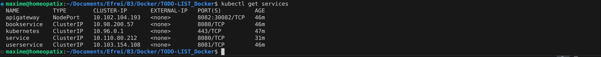
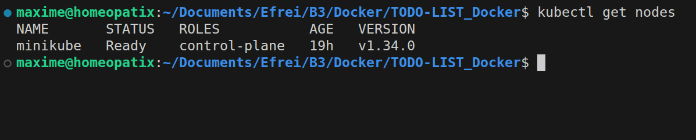

# To-Do List Microservices — Docker & Kubernetes

## 1. Description du projet

Ce projet met en œuvre une architecture microservices pour la gestion d'une To-Do List, composée de :

- **UserService** : gestion des utilisateurs (CRUD)
- **TaskService** : gestion des tâches (CRUD)
- **APIGateway** : point d'entrée unique pour les utilisateurs et tâches, basé sur Spring Cloud Gateway

L'ensemble est conteneurisé avec Docker et peut être orchestré avec Kubernetes (Minikube).

### Architecture

```
Client → API Gateway → UserService / TaskService
```

Pour vérifier la communication inter-services, la route **User-Tasks** permet d'associer un utilisateur à une tâche et de marquer une tâche comme terminée.

## 2. Technologies utilisées

- Java 21
- Spring Boot 3.2.1
- Spring Data JPA
- Spring Cloud Gateway
- H2 Database
- Docker
- Docker Compose
- Kubernetes (Minikube)
- kubectl
- curl (tests des endpoints REST)

## 3. Répartition du travail

### Maxime Desclaux

- Mise en place du TaskService (CRUD des tâches)
- Création et tests des endpoints tasks
- Mise en place des commandes curl pour les tâches

### Florine Saidi

- Mise en place du UserService (CRUD des utilisateurs)
- Création et tests des endpoints users
- Mise en place des commandes curl pour les utilisateurs

### Travail commun

- API Gateway (routes user-tasks)
- Communication inter-services (User ↔ Task)
- Dockerisation et Docker Compose
- Tests d'intégration via curl
- Préparation des captures d'écran
- Déploiement Kubernetes avec Minikube

## 4. Lancement avec Docker Compose

Se placer dans le dossier du projet contenant le fichier `docker-compose.yml` :

```bash
docker compose build
docker compose up -d
```

### Accès aux services

- **UserService** : http://localhost:8081/users
- **TaskService** : http://localhost:8080/tasks
- **API Gateway** : http://localhost:8082/user-tasks

## 5. Déploiement avec Kubernetes (Minikube)

### Prérequis

- Docker installé
- kubectl installé
- Minikube installé

### ⚠️ Important

Les images Docker étant construites localement, il est nécessaire de reconstruire les images dans l'environnement Minikube avant le déploiement Kubernetes.

### Démarrage de Minikube

```bash
minikube start
```

Si Minikube rencontre des problèmes (pods bloqués, erreurs d'images, ErrImagePull, etc.), il est recommandé de réinitialiser complètement l'environnement :

```bash
minikube delete
minikube start --driver=docker
```

Vérification du cluster :

```bash
kubectl get nodes
```

### Déploiement des services Kubernetes

Se placer à la racine du projet puis exécuter :

```bash
kubectl apply -f k8s/
```

Vérification de l'état des pods :

```bash
kubectl get pods
```

Tous les pods doivent être en statut **Running**.

Vérification des services exposés :

```bash
kubectl get services
```

### Accès à l'API Gateway via Minikube

L'API Gateway est exposée via un Service NodePort :

```bash
minikube service apigateway
```

## 6. Tests fonctionnels via curl

### Gestion des utilisateurs (UserService)

```bash
# Lister tous les utilisateurs
curl http://localhost:8081/users

# Créer un utilisateur
curl -X POST http://localhost:8081/users \
-H "Content-Type: application/json" \
-d '{"name":"Maxime","email":"maxime@example.com"}'

# Modifier un utilisateur
curl -X PUT http://localhost:8081/users/1 \
-H "Content-Type: application/json" \
-d '{"name":"Maxime Modifié","email":"maxime.mod@example.com"}'

# Supprimer un utilisateur
curl -X DELETE http://localhost:8081/users/2
```

### Gestion des tâches (TaskService)

```bash
# Lister toutes les tâches
curl http://localhost:8080/tasks

# Créer une tâche
curl -X POST http://localhost:8080/tasks \
-H "Content-Type: application/json" \
-d '{"title":"Nouvelle tâche","description":"Tester POST","completed":false}'

# Modifier une tâche
curl -X PUT http://localhost:8080/tasks/1 \
-H "Content-Type: application/json" \
-d '{"title":"Faire les courses modifié","description":"Acheter fruits et légumes","completed":true}'

# Supprimer une tâche
curl -X DELETE http://localhost:8080/tasks/2
```

### Communication inter-services (API Gateway)

```bash
# Lister toutes les associations user-tasks
curl http://localhost:8082/user-tasks

# Associer un utilisateur à une tâche
curl -X POST http://localhost:8082/user-tasks \
-H "Content-Type: application/json" \
-d '{"userId":1,"taskId":3}'

# Supprimer une association
curl -X DELETE http://localhost:8082/user-tasks/1
```

## 7. Captures d'écran recommandées

### Docker Compose

- `docker compose ps`
- `docker compose logs`


### Tests curl

- CRUD UserService
- CRUD TaskService
- Communication via API Gateway


### Kubernetes (Minikube)

- `kubectl get pods`


- `kubectl get services`



- `kubectl get nodes`




## 8. Conclusion

Ce projet démontre la mise en œuvre complète :

- Architecture microservices
- Conteneurisation avec Docker
- Orchestration avec Kubernetes (Minikube)
- Communication inter-services via API Gateway
- Tests fonctionnels via curl
- Déploiement reproductible et documenté
